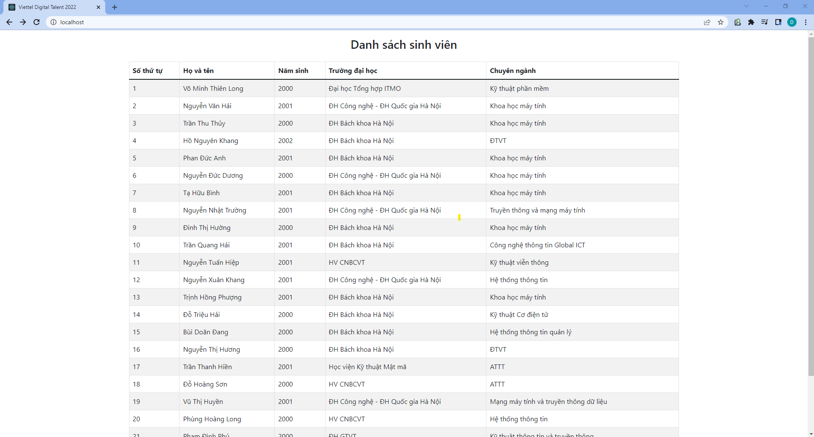

# **Viettel Digital Talent - Practice 3: Set up a three-tier web application that displays the course attendees’ information on the browser using docker-compose.**
## **Table of Contents**

[I. Overview](#overview)   

       
[II. Step-by-step](#steps)
   - [1. Set up virtual environment](#venv)            
   - [2. Install dependencies](#dependencies)    
- [References](#refs)             
----  

## I. Overview
<a name='overview'></a >      

### 1. Docker 

### 2. Docker Compose

## II. Step-by-step 
<a name='steps'></a >      

### 1. Install Docker

Before going into this practice, please make sure that you have already installed and downloaded `Docker`. If you do not havbe Docker on your computer, please follow these tutorials belows to install and download `Docker`. Make sure that you follow the right one depends on your operating system:

   - [Install Docker Desktop on Mac](https://docs.docker.com/desktop/mac/install/) 
   - [Install Docker Desktop on Windows](https://docs.docker.com/desktop/windows/install/)
   - [Install Docker Desktop on Linux](https://docs.docker.com/desktop/linux/install/)

### 2. Install Docker Compose

In order to install `Docker Compose`, please follow [this instruction](https://docs.docker.com/compose/install/). Note that on desktop systems like Docker Desktop for Mac and Windows, `Docker Compose` is included as part of those desktop installs so you don't have to install `Docker Compose` seperately. 

### 3. Setup development environment

#### a. Setup backend

#### b. Setup frontend

#### c. Setup mongodb

#### d. Result

### 4. Setup production environment

#### a. Setup backend

#### b. Setup frontend

#### c. Setup mongodb

#### d. Result

   

<!-- ### 1. Set up virtual environment
<a name='venv'></a >      

- Firstly you need to set up an virtual environment for Python in order to keep dependencies from multiple projects not conflict with each other. If your Python version is 3.3 or above, you don't need to install anything because the standard library has already provided virtualenv under the module "venv". Just type the below command to setup virtualenv:

```
$ python -m venv ./venv  
```

- If you Python version is older, you'll need to install [this Python utility](https://virtualenv.pypa.io/en/stable/) which allows you to create and manage Python virtual environments. Use the virtualenv command to create a new virtual environment

```
virtualenv --python C:\Path\To\Python\python.exe venv
```
- To activate the virtualenv:

```
.\venv\Scripts\activate
```

### 2. Intall dependencies
<a name='dependencies'></a >      

- Firstly, install Flask and the Twilio Python SDK:

```
pip install Flask gunicorn flask-mongoengine
```

-Create requirement.txt file:
```
pip freeze > requirements.txt
``` -->
## Tài liệu tham khảo
<a name='refs'></a >      

[1] https://www.digitalocean.com/community/tutorials/how-to-set-up-flask-with-mongodb-and-docker
 
